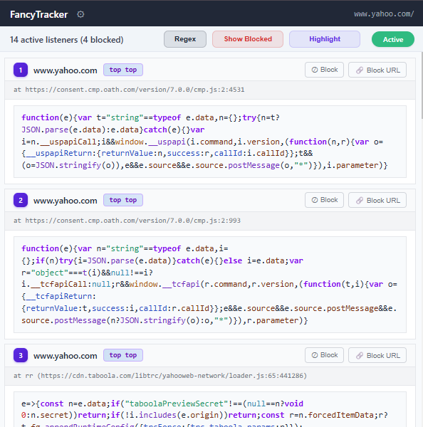
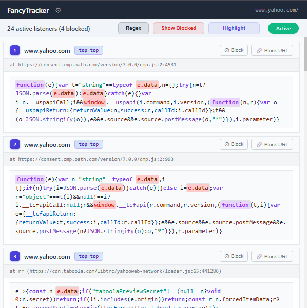
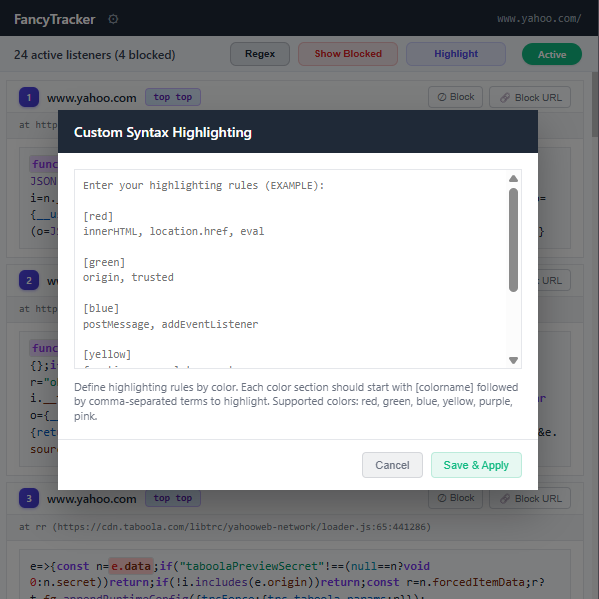
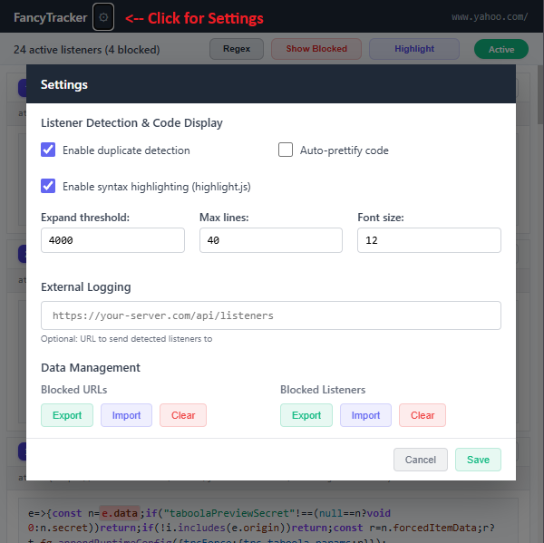

# FancyTracker - Firefox

A browser extension for monitoring `postMessage` listeners in web pages.

This is a modern adaptation of the original [postMessage-tracker](https://github.com/fransr/postMessage-tracker) by [Frans Rosén](https://twitter.com/fransrosen). The base logic and functionality still exists (at least it should work the same), although it has been built upon quite a lot.

A **LOT** of **vibing** has been going on in here, especially for this port over to firefox due to repeated requests.

**Known issues in FF release:**
1. **Import/Export of blocked URL's / listeners is broken.**

## Chrome version will be prioritized:
### [FancyTracker - Chrome](https://github.com/Zeetaz/FancyTracker)  
## Installation (Requires **Firefox Developer Edition**)

#### 1. Allow unsigned extensions (required for self-distributed extensions)

- Type `about:config` in Firefox address bar
- Click `"Accept the Risk and Continue"`
- Search for `xpinstall.signatures.required`
- Double-click to set it to `false`

#### 2. Install the extension

- Open `about:addons` in Firefox
- Click the gear icon (⚙️) at top right
- Select `"Install Add-on From File..."`
- Choose your `fancytrackerFF.xpi` file
- Click `"Add"` when prompted

#### It should soon be available on the Mozilla Extensions "store"... hopefully

## Gallery

<table>
<tr>
<td align="center">

 <b>Main Interface</b>
 <i>Listener detection</i>
</td>
<td align="center">

 <b>Main Interface</b>
 <i>... with highlighting configured</i>
</td>
</tr>
<tr>
<td align="center">

 <b>Highlighting Configurations</b>
 <i>Code syntax customization</i>
</td>
<td align="center">

 <b>Global Settings</b>
 <i>Dedupe, Prettify, import/export, logging</i>
</td>
</tr>
</table>

## To-Do:
- Make extension blocklist customizable via UI settings...
- Fix a forced reload of the UI after applying custom highlight in certain scenarios - for now, just re-open the extension once if it does not apply instantly. Not a big deal.
- Rest should work fine, let me know otherwise.

## Stuff

**General Syntax Highlighting** - Added support for syntax highlighting using [highlight.js](https://github.com/highlightjs/highlight.js).

**Listener Detection** - Monitors all `postMessage` event listeners across frames and origins, showing their source code and stack traces.

**Deduplication** - Automatically filters out duplicate listeners (**ON** by default - u prob want this at all times). When enabled, identical listeners from the **(explicitly) same source** are shown only once.

**Code Prettify** - Formats minified JavaScript code for better readability. Handles large code blocks efficiently with caching.

**Syntax Highlighting** - Color-code specific terms in listener code using custom rules. Define patterns like `[red] innerHTML, eval [green] origin, trusted`.

**Filtering & Blocking** - Block unwanted listeners by code or source URL. Toggle between "Show Active" and "Show Blocked" views. Hardcoded filters for common extensions (wappalyzer, domlogger).

**Import/Export** - Save and restore your blocked lists as JSON files for backup or sharing across installations.

**External Logging** - Optionally send all detected listeners to your own server endpoint for centralized monitoring.

**Regex Filtering** - Added support to filter listeners via regex as well

**Settings** - Added support for manually adjusting fopnt size of code blocks as well as max lines / code length until expansion trigger

- **Note:** Might add better SPA support at a later date... but it is annoying.

## New Features
### 🆕 Added optimization
- Should be good enough, but there is a certain scenario where it could become a bit slow, basically only exists on one page on the internet that I can find so I wont tell you where or what. Shouldn't matter either way, causes like a 0.15sec loading delay.

### 🆕 Added a bunch of settings/features
#### Settings
 - Added new settings options to import/export blocked listeners
 - Added/moved support for logging to an external domain - Will log all listeneres, located within the settings instead of "options"
 - Users can choose to "prettify" the listeners - Working (ish)
#### Bugs...
- Fixed a bunch of reconnection issues, error handling, optimization, deduplication in rare events, UI improvements, and a lot more...
- Fixed persistence bug where, compared to frans v2 it keeps the "state" - This is **not** how service-workers want to work in V3 so we had to vibe a lot - seems to work
- In V3 tab switching triggers a "loading" status, so we had to change a bit so it triggers on any status

### 🆕 Enhanced UI and Stuff

- **UI** - Fixed a looooot of stuff with regards to readability
- **Filtering** - Added support for filtering of listeners and urls (ignore listeners we know are safe for example)
- **Highlighting** - Added support for highlighting context specific stuff in the code from the trackers

### 🆕 Extended Wrapper Detection & Unwrapping

This version adds support for many additional JavaScript wrapper libraries that the original extension didn't unwrap:

#### **New Error Monitoring Tools:**
- **LogRocket** - Session replay and error tracking
- **Honeybadger** - Full-stack error monitoring  
- **TrackJS** - JavaScript error tracking with telemetry
- **Raygun** - Real-time error and performance monitoring
- **Errorception** - Simple JavaScript error tracking

#### **Framework Wrappers:**
- **Angular Zone.js** - Automatic change detection wrappers
- **Vue.js** - Vue error handler wrappers
- **React** - React error boundary wrappers

#### **Generic Pattern Detection:**
- **Session Replay Tools** - Broad pattern for session recording wrappers
- **Performance Monitors** - Generic performance tracking wrappers  
- **Analytics Tools** - Event tracking and analytics wrappers

**Note:** Some may work better than others, some might not even work, it seems to work at least.

**Edit:** Forgot why I even added this tbh but now it's there.

## Original Features

- Tracks `postMessage` listeners in all frames
- Shows message paths in the DevTools console
- Supports listener logging to an external URL
- Handles wrapped listeners from tools like jQuery, New Relic, etc.
- Options available in `chrome://extensions` > Extension details

## Credits

Originally created by [Frans Rosén](https://twitter.com/fransrosen). This version is a standalone adaptation built on top of his work.

Of course, credit is due the AI overlords as well.

## License

Based on original code by [Frans Rosén](https://twitter.com/fransrosen), adapted under the MIT License.

